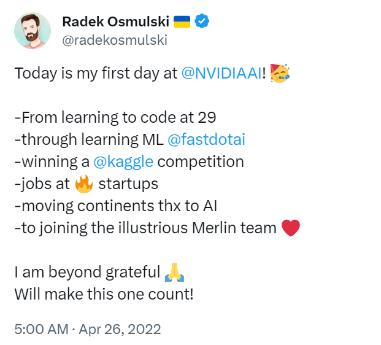
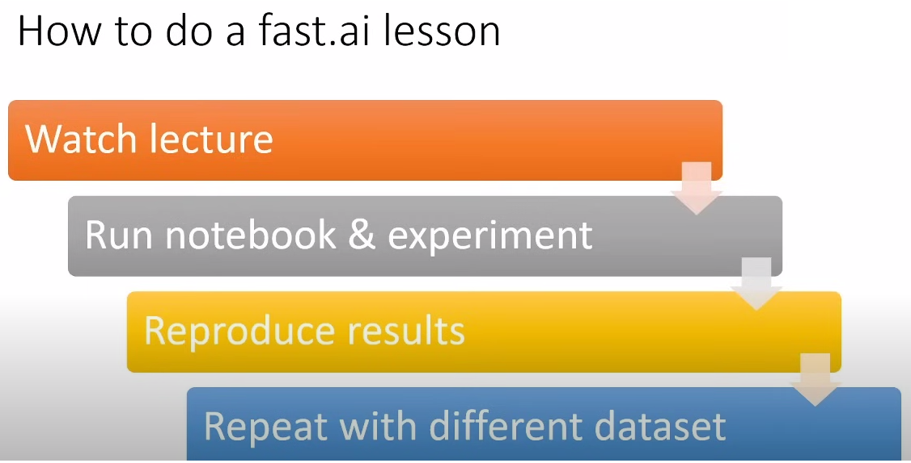

#  Fastbook Insights: Notes, Exercises, and Advanced Experiments for Fastai's Book

Taking notes, deepening assignment and experimenting with the material from [fastbook](https://github.com/fastai/fastbook), the book offered by [fastai](https://www.fast.ai/) and the relative [course](https://course.fast.ai/), available freely on [YouTube](https://www.youtube.com/playlist?list=PLfYUBJiXbdtSvpQjSnJJ_PmDQB_VyT5iU). Material from the course can be found [here](https://github.com/fastai/course22)!

## Why this repository?

In my journey, I consider myself a good guy  with a robust engineering background: an apparently perfect launchpad for deep-learning. By chance, I came across a book on ["Meta-Learning"](https://radekosmulski.gumroad.com/l/learn_deep_learning), thinking it would uncover details to implement ML systems able to learn autonomously from different tasks and adapting their behavior accordingly. 

As it turns out, the book had a different agenda: it was about the how people can improve in their skills in learning, with a focus on deep learning. Intrigued, I started reading it, realizing that something was amiss with my approach. Sure, I had delved into Machine Learning, deep-learning, and dissected Auto-Regressive models from a theoretical perspective at the university. Further, I had 3 years of experience at work and also some practice with personal projects. Nevertheless, I felt that I could inject more life into my understanding by putting myself in someone else's shoes.

Radek Osmulski, the author of **"Meta Learning: How To Learn Deep Learning And Thrive In The Digital World"** couldn't code at 29 and lacks a college degree. Now he is now a Senior Data Scientist at Nvidia. 

From his book, I gathered the most important ideas that piqued my interest: 
- the right balance between theory and practice (one cup of theory, one cup of practice!);
- the importance of developer skills and how to improve it (i.e. coding);
- the significance of taking notes (that's why this notes);
- the importance of sharing experience (again, that's why this notes).

Hence, I aimed to leverage all the concepts in his book to challenge myself and start learning differently and more practically. Osmulski, in his book, suggests "fastbook" by fast.ai as one of the best starting points to learn.

Upon reading the book information, I was amazed by its approach. Even though I had already taken many courses that started from the basics, there was undeniable value in tracing the author's journey from the first lesson. The author of the book and the corresponding course is Jeremy Howard, the former President and Chief Scientist of Kaggle. I admired his lectures, notebooks, and, most of all, his approach to deep learning and coding.

Finally, I decided I was in, and I began taking notes as a diligent developer. Engaging deeply with the book's content, I dedicated time to hands-on practice, constructing a tangible portfolio featuring various projects. I hope my experience could be valuable to other professionals venturing into the realm of deep learning.

## How to learn with fastai

If you follow the structure of the course [here](https://course.fast.ai/), you may miss the [Lesson "0"](https://www.youtube.com/watch?v=gGxe2mN3kAg&t=29s), but it could be helpful to begin the course, as it explain the best practice to enjoy it and hot to make it works!
The ideal path to follow the course is....

The reccomantation from Jeremy:
- Read the fastbook: Roughly, one lesson of the course corresponds to one chapter of the book. Finish it to make it works!
- Focus on making a one really great project and go on with it with coding and deep-learning experience
- For the previous two points, you are asked to be tenacious and go on!
- Write code, make experiments, train models! Coding is vital in AI....
- Share your work, share experience, start blogging, use Twitter and wathever lets you connect to other DL professionists!
- Use the [forum](https://forums.fast.ai/) and share your projects on it!
- Join a competition on Kaggle!

Extra materials:
- [CS50](https://pll.harvard.edu/course/cs50-introduction-computer-science) Harvard....
- The missing semester of your CS education [here](https://missing.csail.mit.edu/)

Environments:
- Jupyter Notebook: [here](https://github.com/fastai/fastbook/blob/master/app_jupyter.ipynb) to...
- Google Colab, just clink on this [link](XXXX) to access it for free (may you want a pro version after some days)..... but unfortunally it is not persistent 
- Gradient from Paperspace, on this [link](https://docs.paperspace.com/gradient/);
- Install on your on a Linux AWS on aws-EC2;

## How to install

git clone.... git import submodules... pip install in notebooks

## Credits
This repository includes my efforts for the fastai course and book, comprising the codebase, notebooks, assignments, and exercises. I've also reported additional experiments within the repository, experimenting with and expanding upon the original content.
